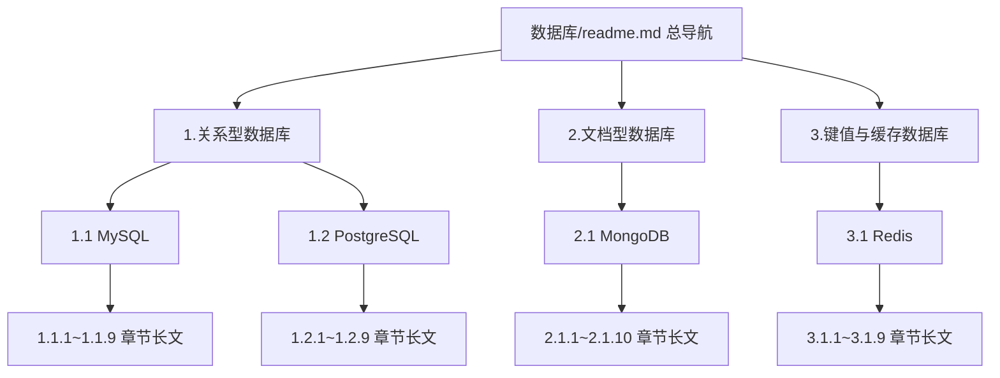

## 用户需求

作为一名精通多数据库源码的工程师与文档整理专家，对 `source/_posts/数据库/` 目录进行系统化整理：

1. 按照主流文档目录架构归类，文件夹带有序号
2. 空白/提纲式文档补全为正式内容
3. 补齐各数据库必须掌握但缺失的主题文件

## 产品概述

将原本平铺的 `MongoDB/ MySQL/ PostgreSQL/ Redis` 四个文件夹，重组为「按数据库类型分组、组内按数据库编号、库内按统一章节编号」的三级有序目录，并为每篇内容文章补全/撰写详细的教程式长文（含原理剖析、源码层面、示例与图示说明）。所有文章遵循站点 Hexo front-matter 规范，readme 作为层级导航索引。

## 核心特性

- 顶层按类型分组：1.关系型数据库 / 2.文档型数据库 / 3.键值与缓存数据库
- 每个数据库内部统一章节模板（入门安装、原理、索引、事务、优化、高可用、运维、实战等）并编号
- 复用 MySQL、Redis 现有实质内容并升级为长文；MongoDB、PostgreSQL 从零撰写
- 全部四个库整理，分两批执行：第一批 MySQL+Redis，第二批 MongoDB+PostgreSQL
- 所有内容文章带 Hexo front-matter；各级 readme 为导航目录树

## 技术栈与规范

- 站点为 Hexo 静态博客（`liuweijie1234.github.io`），文章存放于 `source/_posts/`，构建时按 `categories` 生成分类。
- 内容文章 front-matter 规范（参考 `AiAgent/...` 既有文章）：

```
---
title: 章节标题
date: 2026-07-30 00:00:00
categories:
- 数据库
- 1.关系型数据库
- 1.1 MySQL
tags:
- mysql
---
```

- `readme.md` 为目录导航：无 front-matter，正文以「编号目录树 + 每层简述」组成（参考 `AiAgent/1.大模型与API接入/readme.md` 风格）。

## 实现方案

- **策略**：先建立顶层类型分组目录与各级 readme 导航，再把现有库文件夹移入对应分组并重命名为带序号形式；随后按库内统一章节模板，将旧文件内容归并到新长文、补齐缺失章节。
- **统一章节模板（库内编号规则）**：1 基础入门与安装 / 2 核心架构与存储原理 / 3 数据模型与类型 / 4 索引 / 5 事务与并发 / 6 查询优化与执行计划 / 7 高可用与分布式 / 8 配置运维 / 9 实战与面试（MongoDB 增加 10 与关系型对比）。各库按自身特性微调章节标题，但保持同层序号一致，便于横向对照。
- **分批执行**：第一批处理内容较全的 MySQL、Redis（迁移+重组+补全）；第二批从零构建空白严重的 MongoDB、PostgreSQL。
- **内容深度**：详细教程式长文，含原理剖析（必要时源码层面）、命令示例、对比表格与图示说明；提纲笔记（如 Redis readme 知识点罗列）升级为结构化正文。

## 实现要点

- 移动文件采用「新建目标路径文件 + 删除旧路径」方式，避免破坏 Hexo 构建；旧零散文件（如 `command.md`、`test.md`、各类提纲）内容并入对应新章节后删除空壳。
- 分类 `categories` 必须与新目录层级严格对应，否则 Hexo 生成分类错位。
- 根 `readme.md` 现有面试题内容迁移至 MySQL 实战章节，根 readme 改为全库总导航。
- 补全新文件前先复用旧库已有实质内容，避免重复劳动。

## 架构设计

整体为三级有序文档树，目录关系如下（mermaid 展示分组与层级）：



## 目录结构（新建/调整）

```
source/_posts/数据库/
├── readme.md                          # [MODIFY] 由单句面试题改为全库总目录导航树
├── 1.关系型数据库/
│   ├── readme.md                     # [NEW] 类型组导航（MySQL/PostgreSQL 概述与索引）
│   ├── 1.1 MySQL/
│   │   ├── readme.md                 # [NEW] MySQL 章节导航
│   │   ├── 1.1.1 基础入门与安装部署.md   # [NEW] 合并 install.md/command.md/三范式/日期转换，补长文
│   │   ├── 1.1.2 存储引擎原理.md        # [MODIFY] 由 存储引擎.md 升级为 InnoDB/BufferPool/redo/undo 长文
│   │   ├── 1.1.3 索引原理与优化.md       # [MODIFY] 归并 索引/ 目录内容，补 B+树/聚簇/覆盖/最左前缀
│   │   ├── 1.1.4 事务与并发控制.md       # [MODIFY] 合并 事务.md/悲观锁和乐观锁.md，补 MVCC/锁/隔离级别
│   │   ├── 1.1.5 查询优化与执行计划.md   # [MODIFY] 合并 优化.md/执行计划explain.md/慢查询和慢查询日志.md
│   │   ├── 1.1.6 复制与高可用.md         # [MODIFY] 合并 主主主从主备复制/主从库读写分离/主从同步延迟问题.md
│   │   ├── 1.1.7 分布式与分库分表.md     # [MODIFY] 由 分布式.md 升级长文
│   │   ├── 1.1.8 配置管理与运维.md        # [NEW] 合并 配置文件ini.md/my.cnf/升级updata.md，补运维长文
│   │   └── 1.1.9 面试与实战.md           # [NEW] 归并 面试/工作/ 目录，补经典题与 5000万订单分页等实战
│   └── 1.2 PostgreSQL/
│       ├── readme.md                 # [NEW] PostgreSQL 章节导航
│       ├── 1.2.1 基础入门与安装部署.md   # [NEW] 从零撰写
│       ├── 1.2.2 体系架构与存储.md       # [NEW] 进程模型/共享缓冲/WAL 原理
│       ├── 1.2.3 数据类型与高级特性.md   # [NEW] JSONB/数组/全文检索
│       ├── 1.2.4 索引.md               # [NEW] B-tree/GIN/GiST/BRIN
│       ├── 1.2.5 事务与MVCC锁.md        # [NEW]
│       ├── 1.2.6 查询优化与执行计划.md   # [NEW]
│       ├── 1.2.7 高可用与流复制.md       # [NEW]
│       ├── 1.2.8 与MySQL对比选型.md     # [NEW]
│       └── 1.2.9 运维与实战.md          # [NEW]
├── 2.文档型数据库/
│   ├── readme.md                     # [NEW] 类型组导航
│   └── 2.1 MongoDB/
│       ├── readme.md                 # [NEW] MongoDB 章节导航
│       ├── 2.1.1 基础入门与安装部署.md   # [MODIFY] 由 install.md 扩展长文
│       ├── 2.1.2 数据模型与BSON文档设计.md # [NEW] 由 readme 大纲补全
│       ├── 2.1.3 CRUD与聚合管道.md       # [NEW]
│       ├── 2.1.4 索引原理与优化.md        # [NEW]
│       ├── 2.1.5 复制集ReplicaSet.md     # [NEW]
│       ├── 2.1.6 分片集群Sharding.md     # [NEW]
│       ├── 2.1.7 事务与一致性.md          # [NEW]
│       ├── 2.1.8 性能优化与监控.md         # [MODIFY] 由 性能比较.md 扩展
│       ├── 2.1.9 使用场景限制与选型.md     # [MODIFY] 合并 使用场景.md/应用范围和限制.md
│       └── 2.1.10 与关系型数据库对比.md    # [NEW]
└── 3.键值与缓存数据库/
    ├── readme.md                     # [NEW] 类型组导航
    └── 3.1 Redis/
        ├── readme.md                 # [NEW] Redis 章节导航（替代旧提纲式 readme）
        ├── 3.1.1 基础入门与安装部署.md   # [MODIFY] 由 install.md 扩展长文
        ├── 3.1.2 数据类型与底层结构.md   # [MODIFY] 由 数据类型.md/队列.md 升级（SDS/跳表/字典/压缩列表）
        ├── 3.1.3 为什么快.md            # [MODIFY] 合并 单进程单线程/纯内存操作/非阻塞IO多路复用机制.md
        ├── 3.1.4 持久化.md             # [MODIFY] 由 持久化.md 升级 RDB/AOF/混合
        ├── 3.1.5 缓存设计.md            # [NEW] 穿透/击穿/雪崩/一致性/旁路缓存，含与MySQL binlog 同步
        ├── 3.1.6 分布式锁与消息队列.md    # [MODIFY] 合并 分布式锁.md/队列.md，补 Redlock 缺陷
        ├── 3.1.7 高可用与集群.md          # [NEW] 主从/哨兵/Cluster/选举
        ├── 3.1.8 内存管理与过期淘汰.md     # [NEW] 过期策略/内存淘汰/大Key热Key
        └── 3.1.9 与Memcached对比及实战.md # [MODIFY] 由 redis和mencached的区别.md 升级
```

## 关键结构（front-matter 模板）

内容文章统一头部格式，categories 必须与新目录层级一致：

```
---
title: <章节标题>
date: 2026-07-30 00:00:00
categories:
- 数据库
- <类型组，如 1.关系型数据库>
- <库编号，如 1.1 MySQL>
tags:
- <关键词>
---
```